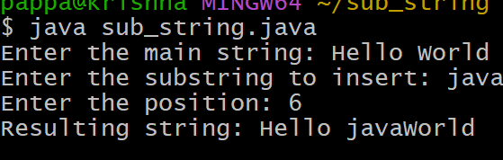
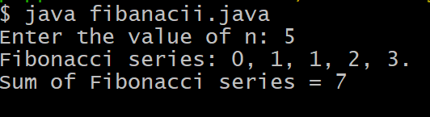

# Additional Experimet 1
## TITLE:To insert a sub string into given main string from a given position
```
class Substring {
    public static void main(String[] args) {
        Scanner sc = new Scanner(System.in);

        System.out.print("Enter the main string: ");
        String mainString = sc.nextLine();

        System.out.print("Enter the substring to insert: ");
        String subString = sc.nextLine();

        System.out.print("Enter the position: ");
        int position = sc.nextInt();

        if (position >= 0 && position <= mainString.length()) {
            String firstPart = mainString.substring(0, position);
            String secondPart = mainString.substring(position);

            String resultString = firstPart + subString + secondPart;
            System.out.println("Resulting string: " + resultString);
        } else {
            System.out.println("Invalid position");
        }
    }
}

```
# output


# Additional experiment2
## TITLE:To find the sum of first n Fibanacci numbers
```
import java.util.Scanner;
class Fibonacci {
    int sum;
    int n;
    int firstNumber;
    int secondNumber;
    int thirdNumber;
    Fibonacci(int number) {
        n = number;
        firstNumber = 0;
        secondNumber = 1;
        thirdNumber = 0;
        sum = 0;
    }
    void generate() {
       if(n>0)
        System.out.print("Fibonacci series: ");
        while (n > 0) {
            if (n == 1) {
                System.out.println(firstNumber + ".");
                sum = sum + firstNumber;
            } else {
                System.out.print(firstNumber + ", ");
                sum = sum + firstNumber;
            }
            thirdNumber = firstNumber + secondNumber;
            firstNumber = secondNumber;
            secondNumber = thirdNumber;
            n--;
        }

        System.out.println("Sum of Fibonacci series = " + sum);
    }
    public static void main(String[] args) {
        Scanner sc = new Scanner(System.in);
        System.out.print("Enter the value of n: ");
        int number = sc.nextInt();
        Fibonacci f = new Fibonacci(number);
        f.generate();
    }
}
```
# output

