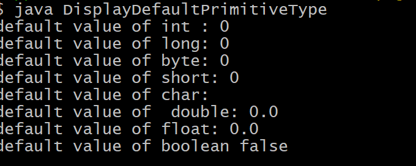
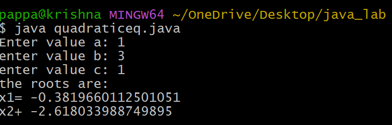

# experiment 1
## Title : 1a.) Display of primitive data types
```
class exp_1a {
static byte b;
static short s;
static int i;
static double d;
static float f;
static char c ;
static boolean bool;
public static void main(String args[]){
System.out.println("default primitive date types:");
System.out.println("byte:"+b);
System.out.println("int:"+i);
System.out.println("double:"+d);
System.out.println("float:"+f);
System.out.println("char:"+c);
System.out.println("bool:"+bool);
}
}
```
# output


# Title : 1b) display of quadratic equation
```
import java.util.scanner;
public class QuadraticEquation {
  public static void main(String[] args) {
   Scanner sc=new Scanner(System.in);
   System.out.print("Enter coffecient a:");
   double a=sc.nextDouble();
   System.out.print("enter coefficient b:");
   double b=sc.nextDouble();
   System.out.print("enter coefficient c:");
   double c=sc.nextDouble();
   double discriminent =b*b-4*a*c;
   if(discriminant>0) {
     System.out.println("roots are real and distinct");
     double root1=(-b+math.sqrt(discriminant))/(2*a);
     double root2=(-b-math.sqrt(discriminant))/(2*a);
     System.out.println("Root1:"+root1);
     System.out.println("Root2:"+root2);
   }
   else if(discriminant==0) {
     System.out.println("roots are real and equal:");
     double root=-b/(2*a);
     System.out.println("Root:"+root);
   }
   else {
     System.out.println("roots are complex and imaginary");
     double realpart=-b/(2*a);
     double imaginaryPart=Math.sqrt(-discriminant)/(2*a);
     System.out.println("Root1:"+realPart+"+"+imaginaryPart+"i");
     System.out.println("Root2:"+realPart+"-"+imaginaryPart+"i");
   }
  }
}

```
# output

