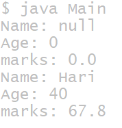
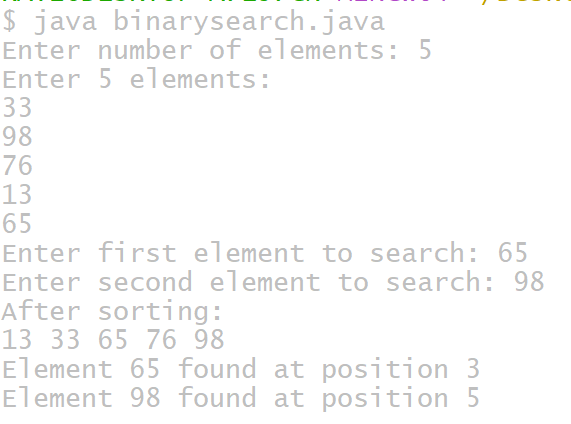

# Experiment3
## TITLE:3a.)implementing consrtuctor overloding in java
```
class Student {
    String name;
    int age;
    int marks;
    // Default constructor
    Student() {
        name = "Not Assigned";
        age = 0;
        marks = 0;
    }
    // 2-parameter constructor
    Student(String n, int a) {
        name = n;
        age = a;
        marks = 0;
    }
    // 3-parameter constructor
    Student(String n, int a, int m) {
        name = n;
        age = a;
        marks = m;
    }
    // Display method
    void display() {
        System.out.println("Name: " + name);
        System.out.println("Age: " + age);
        System.out.println("Marks: " + marks);
    }
    // Main method
    public static void main(String[] args) {
        Student s1 = new Student();                 // default constructor
        Student s2 = new Student("Alice", 20);      // 2-parameter constructor
        Student s3 = new Student("Bob", 22, 90);    // 3-parameter constructor
        s1.display();
        s2.display();
        s3.display();
    }
}
```
# output


## TITLE:3b.)overloding binary search alogorithm
```
mport java.util.Arrays;
import java.util.Scanner;

class BinarySearchDemo {

    public static void main(String[] args) {

        Scanner sc = new Scanner(System.in);

        // Read number of elements
        System.out.print("Enter number of elements: ");
        int n = sc.nextInt();

        int[] arr = new int[n];

        // Read array elements dynamically
        System.out.println("Enter " + n + " elements:");
        for (int i = 0; i < n; i++) {
            arr[i] = sc.nextInt();
        }

        // Display original array
        System.out.print("Elements: ");
        for (int x : arr) {
            System.out.print(x + " ");
        }
        System.out.println();

        // Read search keys
        System.out.print("Enter first element to search: ");
        int key1 = sc.nextInt();

        System.out.print("Enter second element to search: ");
        int key2 = sc.nextInt();

        // Sort the array
        Arrays.sort(arr);

        System.out.println("After sorting, the array becomes:");
        for (int x : arr) {
            System.out.print(x + " ");
        }
        System.out.println();

        // Binary search for key1
        int pos1 = binarySearch(arr, key1);
        if (pos1 != -1) {
            System.out.println("Element " + key1 + " found at position " + pos1);
        } else {
  GNU nano 8.7                                                                      3b.java
        // Read search keys
        System.out.print("Enter first element to search: ");
        int key1 = sc.nextInt();

        System.out.print("Enter second element to search: ");
        int key2 = sc.nextInt();

        // Sort the array
        Arrays.sort(arr);

        System.out.println("After sorting, the array becomes:");
        for (int x : arr) {
            System.out.print(x + " ");
        }
        System.out.println();

        // Binary search for key1
        int pos1 = binarySearch(arr, key1);
        if (pos1 != -1) {
            System.out.println("Element " + key1 + " found at position " + pos1);
        } else {
            System.out.println("Element " + key1 + " not found in the list");
        }

        // Binary search for key2
        int pos2 = binarySearch(arr, key2);
        if (pos2 != -1) {
            System.out.println("Element " + key2 + " found at position " + pos2);
        } else {
            System.out.println("Element " + key2 + " not found in the list");
        }

        sc.close();
    }

    // Binary Search Method (1-based index)
    static int binarySearch(int[] arr, int key) {
        int low = 0, high = arr.length - 1;

        while (low <= high) {
            int mid = (low + high) / 2;

            if (arr[mid] == key)
                return mid + 1; // 1-based index
            else if (arr[mid] < key)
                low = mid + 1;
            else
                high = mid - 1;
        }
        return -1;
    }
}
```

