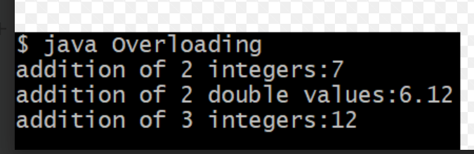

# EXPERIMENT 2
## TITLE : 2a.) Imeplimenties class mechanism in java
```
class square {
  int length;
  int areaofsquare(){
     return length*length;
  }
  int perimeterofsquare(){
     return 4*length;
  }
}
class main {
  public static void main(String arg[]){
  square sq=new square();
  sq.length=5;
  int area = sq.areaofsquare();
  int perimeter = sq.perimeterofsquare();
  System.out.println("area of square:"+area);
  System.out.println("perimeter of square:"+perimeter);
  }
}
```
# OUTPUT


## TITLE :2B.) Implements method overloading in java
```
class add{
 int add(int a,int b){
   return a+b;
 }
 double add(double a,double b){
   return a+b;
 }
 int add(int a,int b,int c){
   return a+b+c;
 }
}
class main{
 public static void main(String arg[]){
   add a=new add();
   System.out.println("addition of two integer:"+a.add(5,6));
   System.out.println("addition of real numbers:"+a.add(3.5,6.7));
   System.out.println("addition of three inters:"+a.add(7,6,5));
 }
}
```
# OUTPUT

